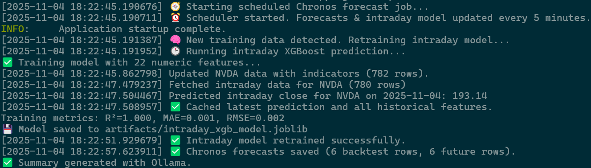
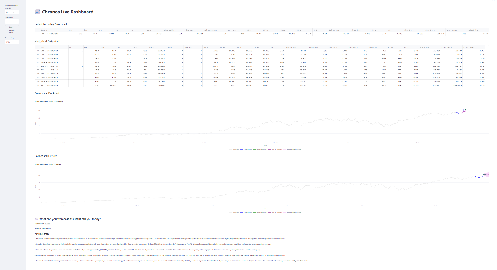
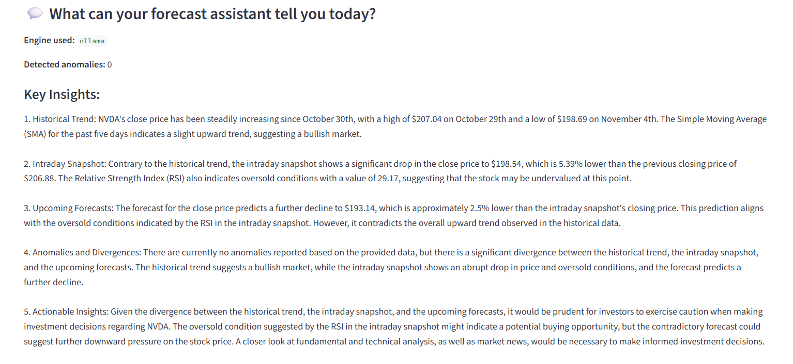

# 🕒 Flowoptim API assistant, Chronos Forecasting NVDA stocks and visual Dashboard

A live end-to-end stock forecasting system powered by FastAPI and [Chronos Forecasting](https://github.com/amazon-science/chronos-forecasting/tree/main), meant for running locally.

## Features
- Real-time intraday data fetching and feature engineering
- Automatic retraining and forecasting with Chronos/XGBoost
- Interactive Streamlit dashboard with live auto-refresh
- FastAPI routes for intraday and future predictions

---

## Get Started

### Clone this repo:

```bash
git clone https://github.com/<your-username>/flowoptim.git
```

### Create your own venv

```bash
cd flowoptim
python -m venv chronosvenv
# activate with source chronosvenv/bin/activate   # Linux
```

### Install Dependencies

```bash
pip install --upgrade pip
pip install -r requirements.txt
```

### Setup .env for LLM

- Make sure you have Ollama installed: https://ollama.com/
- Run the local Ollama server:

In case user prefers to not download ollama, one could use keys. This step is optional and only works if you have a .env file in the project root with your keys (if you have access to any keys from OpenAI or HuggingFace).


```bash
# .env file
OPENAI_API_KEY=your_openai_api_key_here
HF_API_KEY=your_huggingface_api_key_here
```

## Run API

### 1

Open terminal

```bash
cd flowoptim 
source chronosvenv/bin/activate
uvicorn app.main:app --reload
```

API should start running with scheduler



### 2

In another terminal

```bash
cd flowoptim
source chronosvenv/bin/activate
cd front
streamlit run dashboard.py
```




